# Kitchenware Classification with TensorFlow Lite

Developing and productization of a Machine Learning model for classification of six kitchen utensils.

The client app is build to classify images of kitchware items using Tensorflow Lite model from the following classes:

- knife
- fork
- spoon
- glass
- cup
- plate

---

## Dataset Description

Initially the dataset was taken from the Kaggle competition which can be found [here](https://www.kaggle.com/competitions/kitchenware-classification). Then it was processed to create labels for test data and then it was split into `train`, `test`, and `eval-images` directories. The notebooks to generate cleaned data are kept in the [data-generator](data-generator) directory.

The `train` and `test` directories have the sub-directories which belong to 6 classes, whereas `eval-images` directory only contains the 6 images representing each class to test model performance on the unseen examples.

---

## Project File Structure and Data

The file structure for the project looks like this:

```
.
|-- LICENSE
|-- README.md
|-- assets
|   |-- bg-image.jpg
|   |-- demo.mp4
|   |-- ...
|-- data-generator
|   |-- kitchenware-datagenerator-part1.ipynb
|   `-- kitchenware-datagenerator-part2.ipynb
|-- datasets
|   |-- kitchenware-dataset
|   |   |-- eval-images
|   |   |   |-- 0196.jpg
|   |   |   |-- 0820.jpg
|   |   |   |-- 1956.jpg
|   |   |   |-- 4470.jpg
|   |   |   |-- 4567.jpg
|   |   |   `-- 5768.jpg
|   |   |-- test
|   |   |   |-- cup
|   |   |   |   |-- 0000.jpg
|   |   |   |   |-- 0008.jpg
|   |   |   |   |-- 0011.jpg
|   |   |   |   |-- ...
|   |   |   |-- fork
|   |   |   |   |-- 0076.jpg
|   |   |   |   |-- 0096.jpg
|   |   |   |   |-- 0121.jpg
|   |   |   |   |-- ...
|   |   |   |-- glass
|   |   |   |   |-- 0022.jpg
|   |   |   |   |-- 0042.jpg
|   |   |   |   |-- 0055.jpg
|   |   |   |   |-- ...
|   |   |   |-- knife
|   |   |   |   |-- 0018.jpg
|   |   |   |   |-- 0034.jpg
|   |   |   |   |-- 0059.jpg
|   |   |   |   |-- ...
|   |   |   |-- plate
|   |   |   |   |-- 0002.jpg
|   |   |   |   |-- 0007.jpg
|   |   |   |   |-- 0019.jpg
|   |   |   |   |-- ...
|   |   |   `-- spoon
|   |   |       |-- 0001.jpg
|   |   |       |-- 0024.jpg
|   |   |       |-- 0033.jpg
|   |   |       |-- ...
|   |   `-- train
|   |       |-- cup
|   |       |   |-- 0003.jpg
|   |       |   |-- 0006.jpg
|   |       |   |-- 0009.jpg
|   |       |   |-- ...
|   |       |-- fork
|   |       |   |-- 0036.jpg
|   |       |   |-- 0063.jpg
|   |       |   |-- 0106.jpg
|   |       |   |-- ...
|   |       |-- glass
|   |       |   |-- 0021.jpg
|   |       |   |-- 0039.jpg
|   |       |   |-- 0045.jpg
|   |       |   |-- ...
|   |       |-- knife
|   |       |   |-- 0012.jpg
|   |       |   |-- 0013.jpg
|   |       |   |-- 0016.jpg
|   |       |   |-- ...
|   |       |-- plate
|   |       |   |-- 0004.jpg
|   |       |   |-- 0010.jpg
|   |       |   |-- 0014.jpg
|   |       |   |-- ...
|   |       `-- spoon
|   |           |-- 0005.jpg
|   |           |-- 0032.jpg
|   |           |-- 0040.jpg
|   |           |-- ...
|   `-- kitchenware-dataset.zip
|-- deployment
|   |-- Dockerfile
|   |-- Pipfile
|   |-- Pipfile.lock
|   |-- img_preprocessor.py
|   |-- kitchenware-model.tflite
|   |-- lambda_function.py
|   |-- requirements.txt
|   |-- stream.py
|   `-- test.py
|-- models
|   |-- efficientnetb0_14_0.962.h5
|   `-- kitchenware-model.tflite
|-- notebooks
|   |-- 01-model-training.ipynb
|   |-- 02-model-evaluation.ipynb
|   `-- 03-tflite-model.ipynb
|-- requirements.txt
`-- tflite-runtime-binaries
    |-- tflite_runtime-2.5.0.post1-cp39-cp39-linux_x86_64.whl
    |-- tflite_runtime-2.5.0.post1-cp39-cp39-macosx_11_0_x86_64.whl
    `-- tflite_runtime-2.5.0.post1-cp39-cp39-win_amd64.whl
```

> Note: Due to large volume of the data the `datasets` directory is not included which contains the kitchenware images.

The structure description:

- `assets`: directory to store video and images
- `data-generator`: directory contains data generator notebooks; `kitchenware-datagenerator-part1.ipynb` to create labels for test data and `kitchenware-datagenerator-part2.ipynb` to split data into train (85%), test (15%), and evaluation images to test model performance.
- `datasets`: directory contains datasets (not included in the project remote repository)
- `deployment`: directory contains all the relevant files for model deployment and web app
- `models`: directory to store models
- `notebooks`: directory contains notebooks
- `requirements.txt`: file contains name and version of the required packages to work with the project
- `tflite-runtime-binaries`: directory contains tflite runtime binaries for Windows, Linux, and MacOS (more on this later)
- `.gitignore`: file to exclude large and secret directories/files to GitHub

> Note: The cleaned dataset is provided therefore, notebooks in `data-generator` are not required to use. But if you wish to use them in that case you'll have to download the dataset from the original source including `csv` files. The link is given above.

---

## Initial Setup and Download Data

Need to follow the steps below if we want to playaround and train our own model:

- Download the data from repository releases using the [link](https://github.com/MuhammadAwon/kitchenware-classification/releases/download/v1/kitchenware-dataset.zip), unzip the file and name the folder as `kitchenware-dataset`
- Create and activate the new Virtual environment in your machine (Conda recommended)
- Clone repository and change directory with `cd kitchenware-classification`
- Install required packages using `pip install -r requirements.txt` and tflite runtime using `pip install --extra-index-url https://google-coral.github.io/py-repo/ tflite_runtime`
- Create directory `datasets` and `cd datasets`, then add `kitchenware-dataset` (which contains image data) into the directory.

In case `pip install --extra-index-url https://google-coral.github.io/py-repo/ tflite_runtime` throwing error then we'll have to install tflite runtime manually using one of the following commands according to the Operating System:

- For Linux: `pip install tflite-runtime-binaries/tflite_runtime-2.5.0.post1-cp39-cp39-linux_x86_64.whl`
- For MacOS: `pip install tflite-runtime-binaries/tflite_runtime-2.5.0.post1-cp39-cp39-macosx_11_0_x86_64.whl`
- For Windows: `pip install tflite-runtime-binaries/tflite_runtime-2.5.0.post1-cp39-cp39-win_amd64.whl`

---

## Test the Project

To quickly run the project and test model predictions:

- Change directory to deployment using `cd deployment` and create a new virtual environment (Pipenv recommended)
- Install the required packages using `pipenv install` and `pipenv install --dev`
- We can test the model locally using the following commands in the terminal:
  - Execute the command `ipython`
  - Next import the lambda function as module using the command `import lambda_function`
  - Call the prediction method to make predictions `lambda_function.prediction('https://m.media-amazon.com/images/I/51c5OmSdwWL._AC_UL320_.jpg')`
  - The image has spoons therefore we should see the output something like this: 
  
    ```
    {'cup': 1.2595837972639856e-07,
    'fork': 0.0019216566579416394,
    'glass': 4.638180143956561e-06,
    'knife': 3.4134104680560995e-06,
    'plate': 8.925200134513034e-09,
    'spoon': 0.9980701804161072}
    ```

---

## Test the Web App Locally

The web app is built using [Streamlit](https://streamlit.io/), we can run the streamlit server to test the model prediction locally with the following steps:

- In the deployment folder create new Pipenv environment and install requried packages using `pipenv install` (Recommended)
- In addition, we need to install requests package for development using `pipenv install requests --dev` as well as install the tflite runtime binary for repective Operating System with the command `pipenv install ../tflite-runtime-binaries/tflite_runtime-2.5.0.post1-cp39-cp39-win_amd64.whl --dev` (note: this will install tflite runtime for Windows and it also assumes that the binary is located in the `tflite-runtime-binaries` directory)
- Run the Streamlit app locally with `streamlit run stream.py`

### Local Streamlit Sever

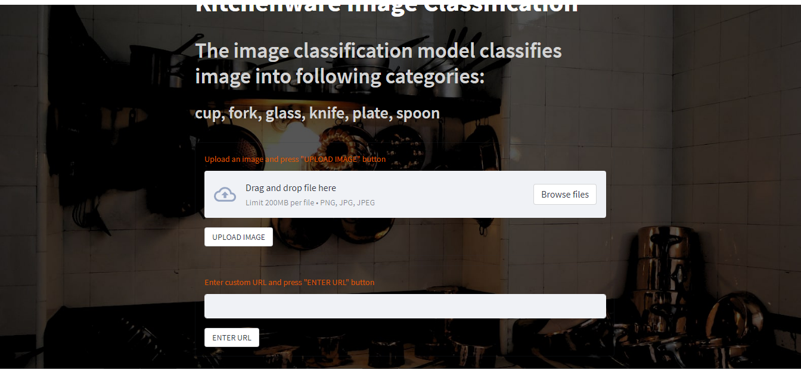

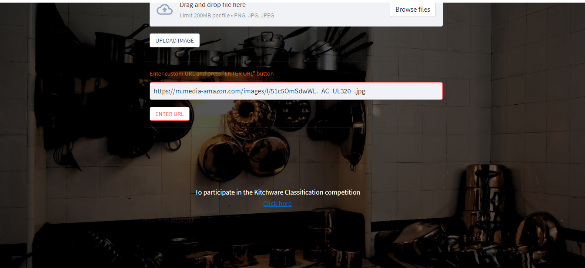

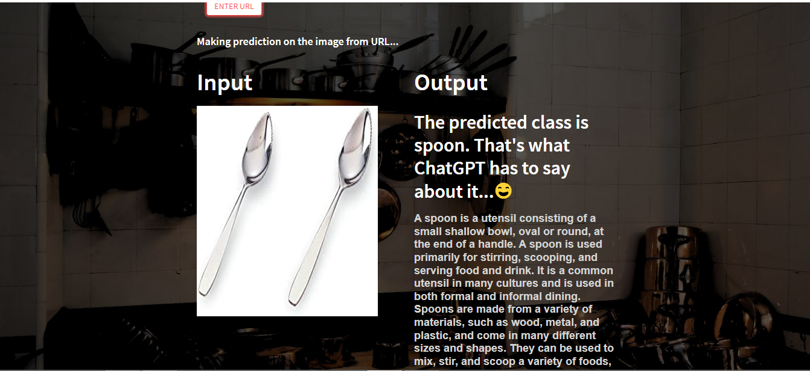

---

## Run the App with Docker Image

We can run the app out of the box using Docker image and run the container. Simply download the already compiled version from [Docker Hub:](https://hub.docker.com/) [Kitchenware Classification](https://hub.docker.com/repository/docker/awon08/tflite-kitchenware-model/general)

```
docker pull awon08/tflite-kitchenware-model:latest
```

Once the image is downloaded, we can run the container with the port 8080:

```
docker run -it --rm -p 8080:8080 awon08/tflite-kitchenware-model:latest
```

On another terminal make sure the Pipenv environment is activated and execute `python test.py`:

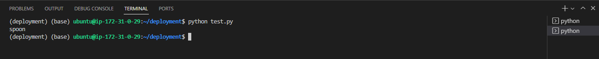

Since the image url in `test.py` belongs to spoon class, it should output spoon for prediction.

---

## Build Customized Docker Image

For any reason if we want to build the docker image, we can do so using `Dockerfile` included in deployment directory. For this purpose we need to run the following command:

```
docker build -t tflite-kitchenware-model .
```

To run the docker container:

```
docker run -it --rm -p 8080:8080 tflite-kitchenware-model
```

Again, on different terminal execute `python test.py` to output model prediction on the image.

---

## Cloud Deployment

In order to deploy the docker container as lambda function we need to following these steps:

### Publish the Image to AWS ECR

- First step is to install awscli for repective OS from the [link](https://docs.aws.amazon.com/cli/latest/userguide/getting-started-install.html) and configure with the credentials
- Visit the [AWS ECR Console](https://ap-south-1.console.aws.amazon.com/ecr/repositories?region=ap-south-1) and click *create repository* (note: in this example the region is *ap-south-1*)
- From general settings choose *private* and name the repository, then hit *create repository* again
- Next click on the repostory and then on *View push commands* to see the instructions on how to push our Docker image on ECR
   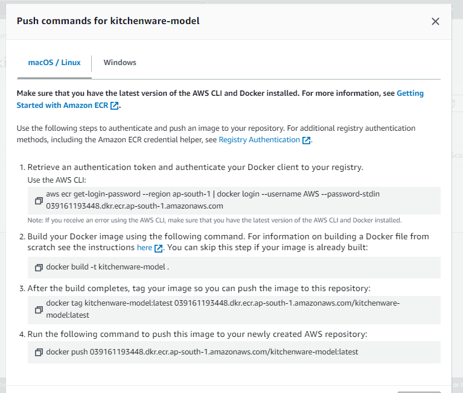

   - Note the name of the repository in the above image is ***kitchenware-model*** and the region is ***ap-south-1***
 - Since we have already build our custom docker image, we can safely skip the **step 2**

We now have container registry with our image.

### Create the Lambda Function using AWS Console

To create Lambda function and test on AWS console we need to follow these steps:

- Search for AWS Lambda from the sreach bar and select *Create function*
- Select *Container image* > give *Function name* > enter *Container image URI* using the *Browse images* button (select the docker image) > Create function
  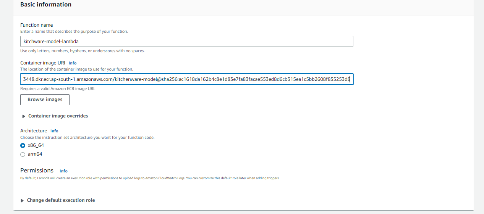
- Next Select *Configuration* > Increase Memory to 1024 and Timeout to 30 sec > *Save*
- Select *Test* to test the function > Add image url in the body (JSON) > *Test*

This should return the successful response with the class name of the image.

### Expose the Lambda Function with API Gateway

We create the lambda function for our docker image, now we need to expose it using AWS API Gateway:

- Search for api gateway > select *Create API* button > Select *REST API* > from Settings (API name) > *Create API*
- Select *Create Resource* from the drop-down of *Actions* button > Resource Name (e.g., `classify`, this will be the endpoint of the url) > *Create Resource*
- Select *Create Method* from *Actions* button > Select *POST* from drop-down of `/classify` > Select ok and then POST > select *Lambda Function* from the *Integration type*, choose the right *Lambda Region*, and *Lambda Function* name > *Save*
- For testing purpose click on yellow *TEST* button > Request Body (url of the image for prediction) e.g. `{"image_url", "https://m.media-amazon.com/images/I/51c5OmSdwWL._AC_UL320_.jpg"}` > Hit *Test*
- Select *Deploy API* from *Actions* button > *Deployment stage* (New Stage) and *Stage name* (test) > *Deploy*
  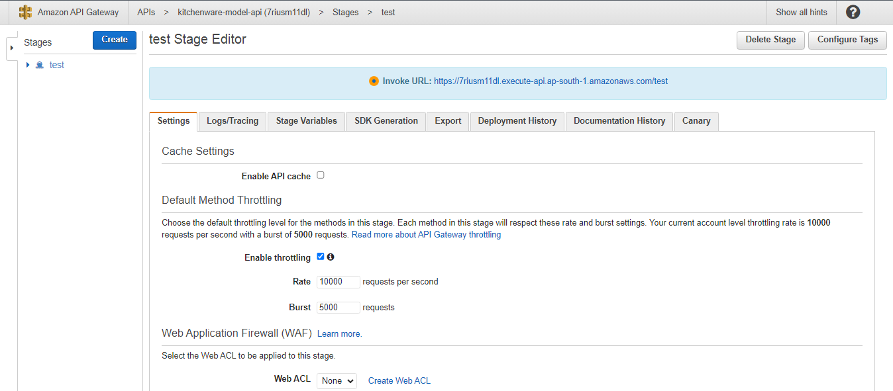
- Copy the *Invoke URL* and paste in the `test.py`, also be sure to add `/classify` at the end of the url since our resource name is classify, e.g., `https://7riusm11dl.execute-api.ap-south-1.amazonaws.com/test/classify`

---

## Deploy the App on Streamlit Cloud

Since we have already installed the packages [python-dotenv](https://pypi.org/project/python-dotenv/) and [Deta](https://www.deta.sh/) from the `Pipfile` all we need is to setup `.env` file:

- Create a file by the `.env` in the deployment directory
- Get the [project key](https://docs.deta.sh/docs/faqs/#what-are-all-the-different-keys-for) from the Deta
- Add our api url from AWS gateway and project key from Deta in the `.env` file. Make sure the names are set as `API_URL` and `PROJECT_KEY` as shown in the image below:
  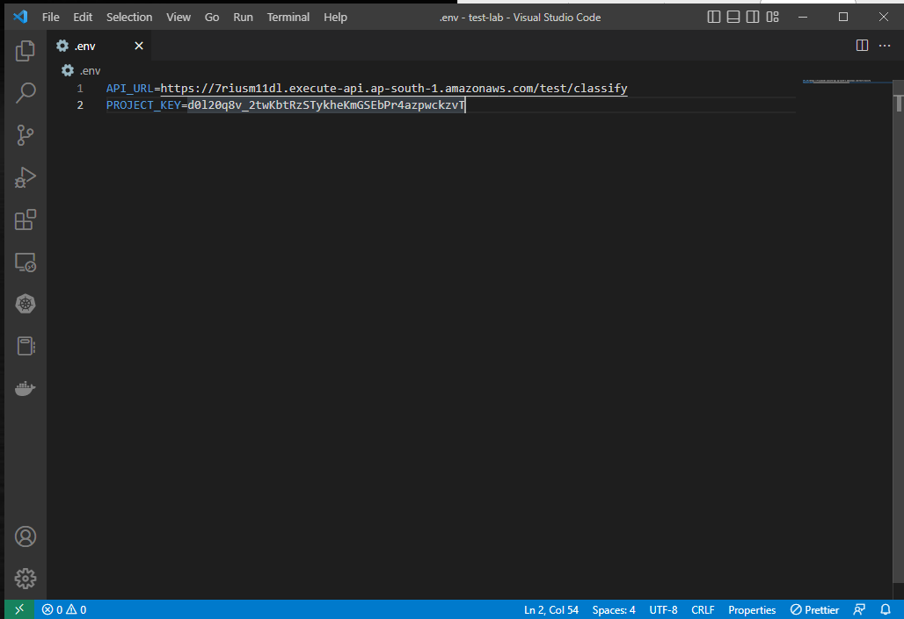
- Push the code to GitHub and sign in to [Streamlit Cloud](https://streamlit.io/cloud)
- Select *New app* and configure the app for deployment. Also make sure to include `API_URL` and `PROJECT_KEY` in the *Secrets* using **Advanced settings** button. Finally, select *Deploy!* to launch
  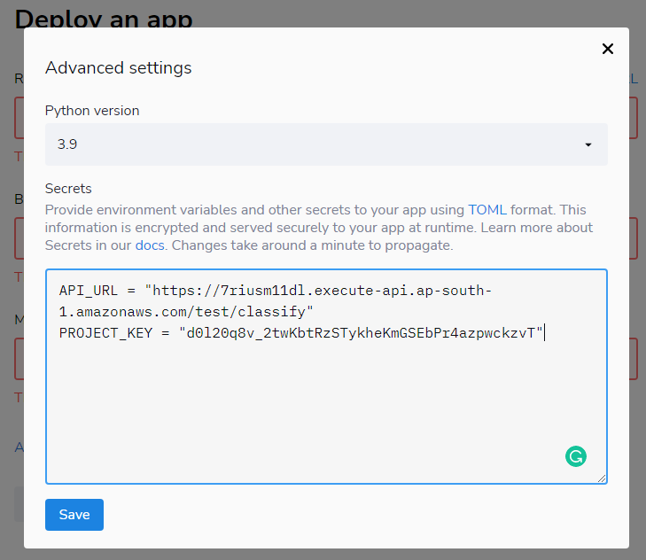
  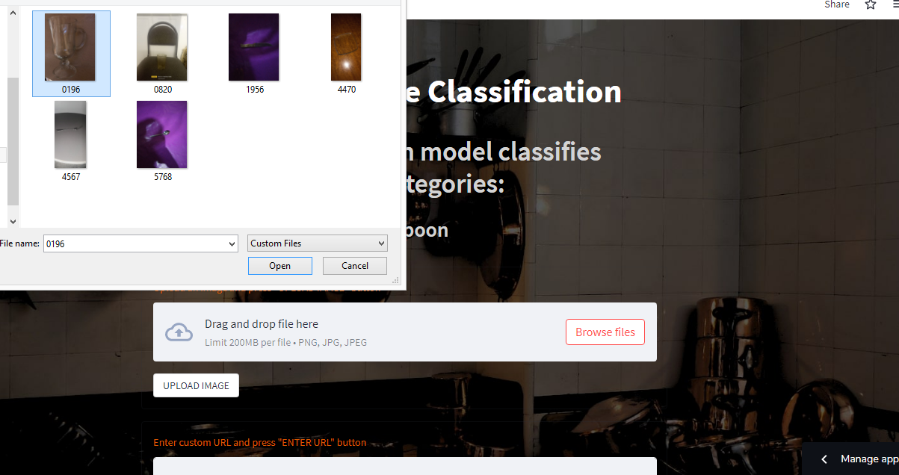
  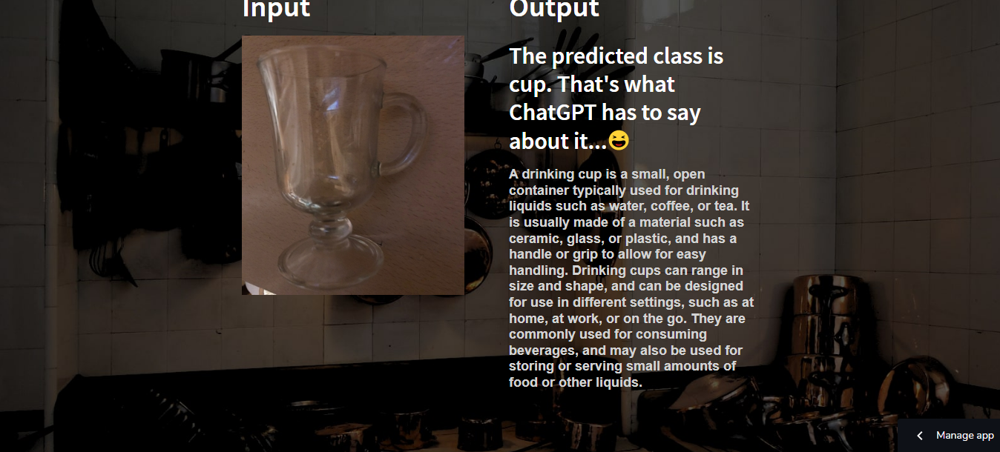
  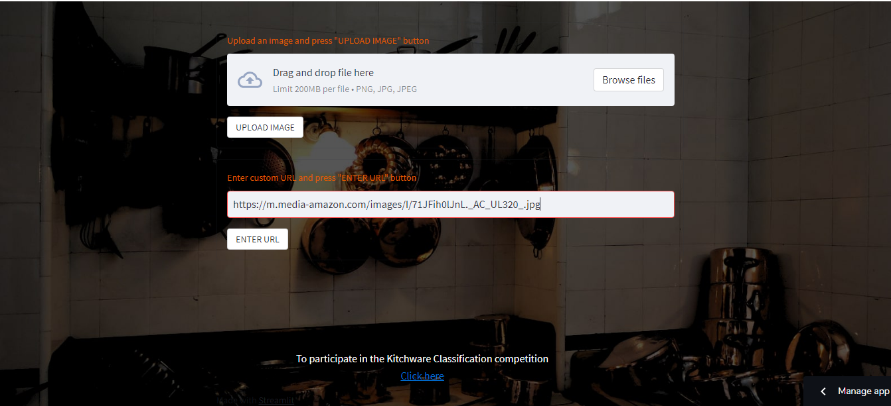
  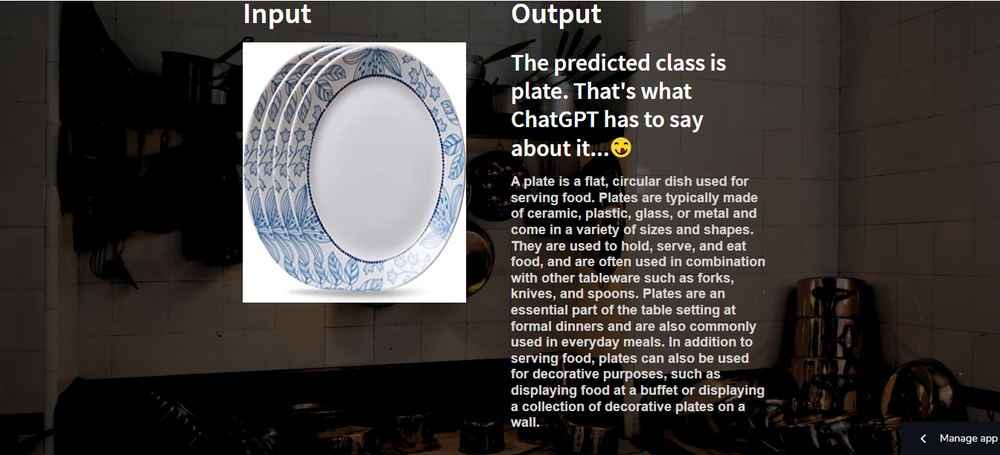

--- 

## To-Do

- Add session state functionality in the `stream.py`

---

## Issues

If you encounter any issues or have feedback, feel free to [open a new issue](https://github.com/MuhammadAwon/kitchenware-classification/issues).
